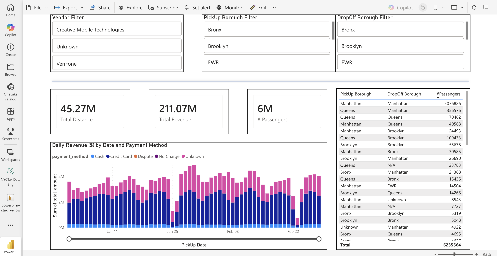
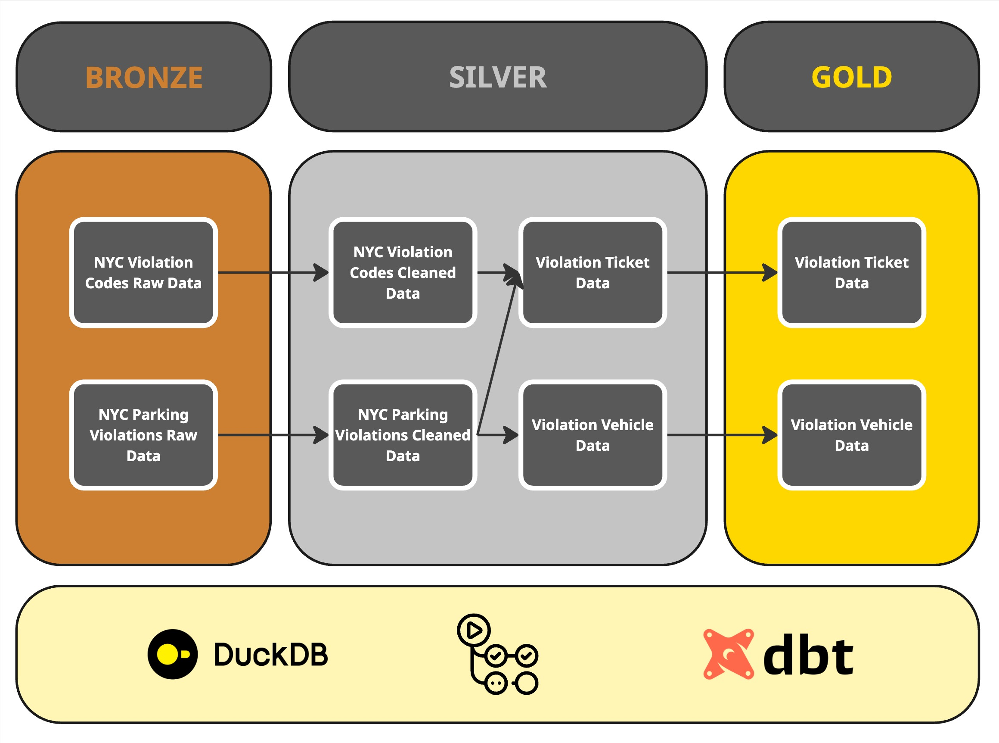

# Max Barati — Data Engineering Portfolio

I design and ship data-centric products end-to-end: ingesting and modeling raw feeds, enforcing quality, and presenting decision-ready views with operational guardrails baked in.

## Capabilities and Stack
- **Programming & Development:** Python, Docker, OOP.
- **Warehousing and Visualization:** dbt, Grafana, Power BI.
- **Cloud Platforms:** AWS (S3, Glue), Microsoft Fabric (Lakehouse, Warehouse, Data Factory).
- **Database Systems:** PostgreSQL, MongoDB, DuckDB.
- **Big Data & Orchestration:** Apache Spark, Apache Airflow, Data Flow Gen2.
- **Connected Systems:** Request/Response and Publish/Subscribe patterns.
- **Geospatial Analysis:** QGIS, GeoPandas.
- **IoT & Automation:** MQTT, InfluxDB, Telegram Bots.

## Featured Work

### NYCTaxiTrips — End-to-End Data Pipeline in Microsoft Fabric
A complete ETL pipeline using Fabric's unified ecosystem: ingesting NYC TLC Parquet files and zone data into a Lakehouse, transforming via Dataflow Gen2, and visualizing trip patterns in Power BI dashboards.

### NYCParkingViolations — dbt Pipeline for NYC Parking Data
A dbt project modeling NYC parking violations with a medallion architecture (bronze → silver → gold). Cleans raw data, enriches with fee logic, and delivers analytics-ready tables for reporting.

### PhDStudenti — Research Workflow Automation
Automates literature ingestion, metadata extraction, and citation hygiene so researchers can iterate on arguments instead of wrangling sources.

### AustinTrips — ETL for Metro Bike-Share Transparency
Spark ETL → Postgres → Grafana. Twelve years of Austin bike-share telemetry are deduplicated, enriched with demand curves, and surfaced via embedded dashboards inside the case study page.

### GlucoIoTBot — IoT Telemetry with Assistive Control Loop
Collects wearable device telemetry, normalizes it, and pairs it with an LLM assistant that summarizes anomalies and recommends operator actions to keep diabetics’ devices compliant.

## Explore My Projects and Background in More Detail at **[barati.tech](https://barati.tech)**. 
