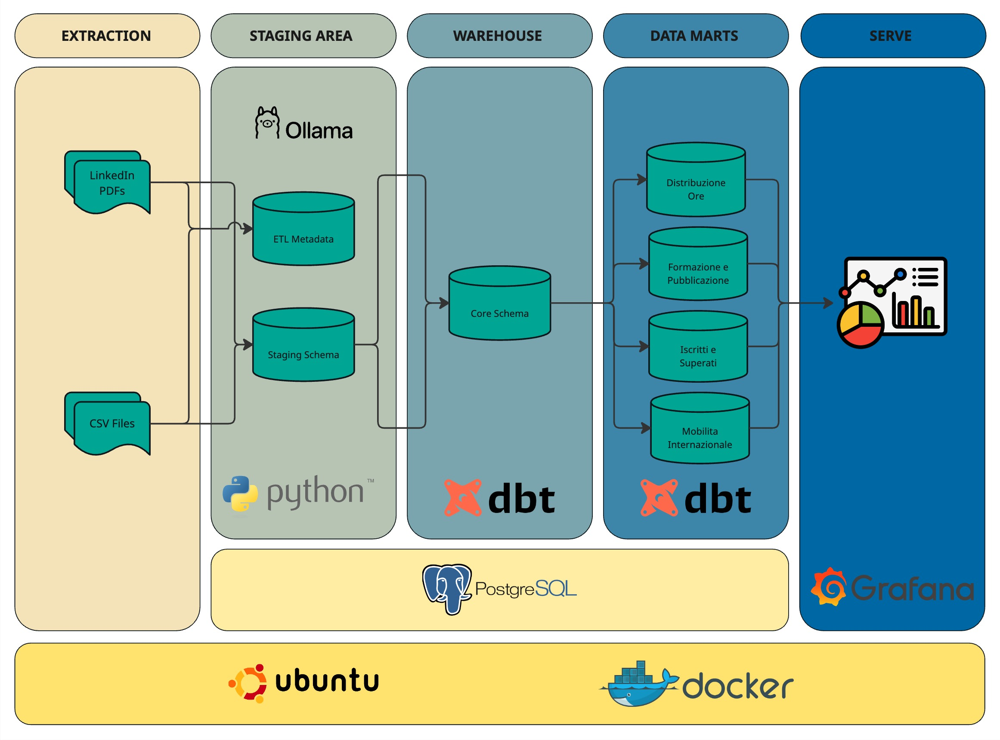
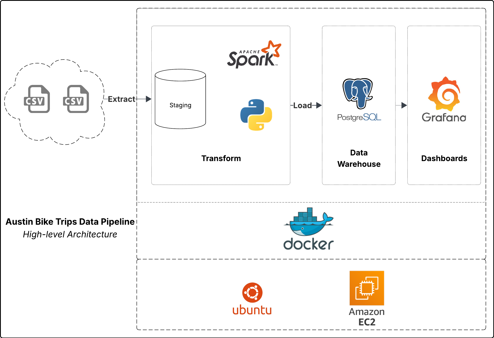
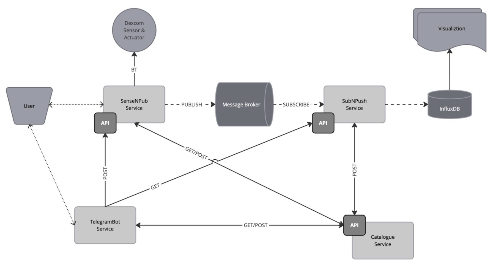

# Max Barati — Technical Portfolio

I design and ship data-centric products end to end: ingesting and modeling raw feeds, enforcing quality, and presenting decision-ready views with operational guardrails baked in.

## Capabilities and stack
- **Programming & development:** Python, Docker.
- **Warehousing and visualization:** dbt, Grafana.
- **Cloud platforms:** AWS S3, AWS Glue.
- **Database systems:** PostgreSQL, MongoDB.
- **Big data & orchestration:** Apache Spark, Apache Airflow.
- **Connected systems:** request/response and publish/subscribe patterns.
- **Geospatial analysis:** QGIS, GeoPandas.

## Featured work

### PhDStudenti — research workflow helper
Automates literature ingestion, metadata extraction, and citation hygiene so researchers can iterate on arguments instead of wrangling sources.

### AustinTrips — ETL for metro bike-share transparency
Spark ETL → Postgres → Grafana. Twelve years of Austin bike-share telemetry are deduplicated, enriched with demand curves, and surfaced via embedded dashboards inside the case study page.

### GlucoIoTBot — IoT telemetry with an assistive control loop
Collects wearable device telemetry, normalizes it, and pairs it with an LLM assistant that summarizes anomalies and recommends operator actions to keep diabetics’ devices compliant.

## Explore my projects and background in more details at **[barati.tech](https://barati.tech)**. 
